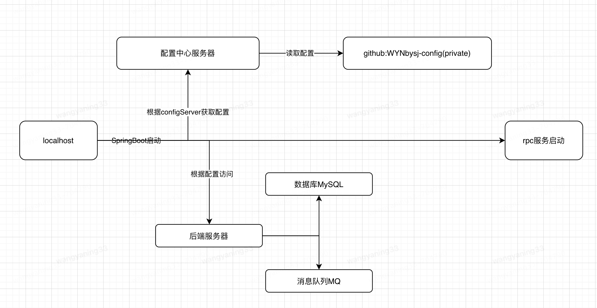

# 王亚宁的本科毕业设计
## 项目名称
基于Alibaba Canal的系统间监听数据库binlog的同步数据的平台搭建。
## 项目整体架构

### 后端
- **开发框架** SpringBoot 3.2.1
- **数据库** MySQL 8.0.35 + MyBatisPlus 3.5.3
- **缓存** Redis
- **监听binlog** Alibaba Canal
- **RPC框架** gRPC
- **消息队列** RabbitMQ
- **Api文档** Swagger2
- **配置中心** Apollo